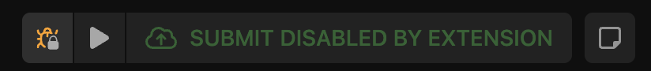
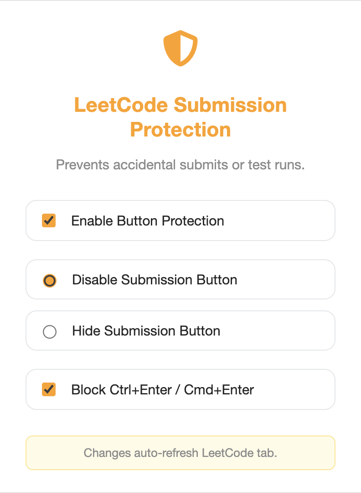
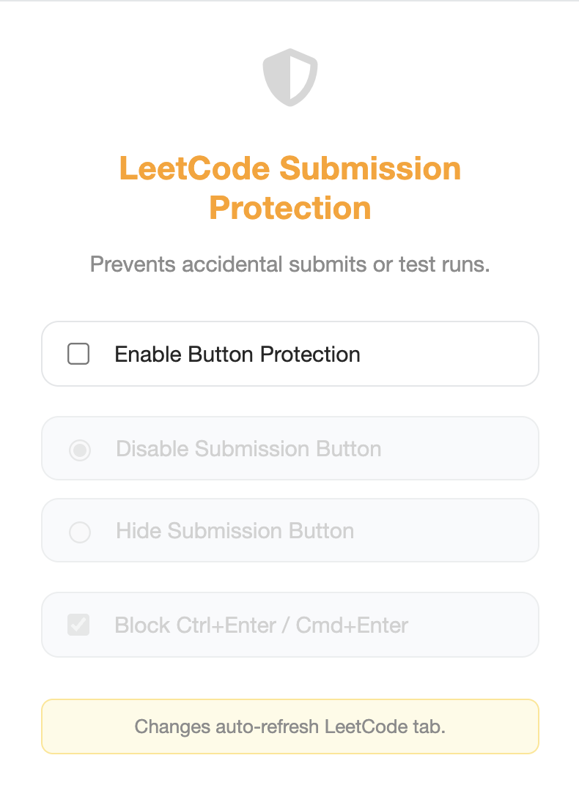
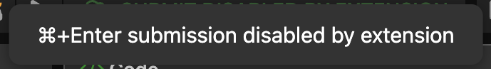

# 🛡️ LeetCode Submission Protection - (1.0.0)

A lightweight and intuitive Chrome Extension that adds an extra layer of protection to prevent **accidental code submissions or test runs** on [LeetCode](https://leetcode.com). Ideal for users who want to avoid unintentional button clicks or keyboard shortcuts while coding.

---

## 🚀 Features

- 🧷 **Disable or hide the "Submit" button** on LeetCode problem pages
- ⛔ **Block accidental `Ctrl+Enter` or `Cmd+Enter`** submissions
- 💾 Saves user preferences with Chrome Sync Storage
- 🔁 Automatically refreshes LeetCode tab when settings change
- ⌨️ Cross-platform shortcut protection (Ctrl+Enter / ⌘+Enter)
- 🎯 Works only on `https://leetcode.com/*`

---

## 📦 Installation

1. Clone or download this repository.

```bash
https://github.com/bit-koda/LeetCode-Submission-Protection.git
````

2. Go to `chrome://extensions` in your Chrome browser.

3. Enable **Developer Mode** (top right).

4. Click **"Load unpacked"** and select the project directory.

5. Done! You’ll see the shield icon in your toolbar.

---

## 🧩 How It Works

* Injects `content.js` to monitor and modify the LeetCode interface
* Detects and optionally disables or hides the submit button
* Listens for `Ctrl+Enter` / `Cmd+Enter` and blocks it if enabled
* Popup UI (`popup.html`) allows configuring:

  * Protection toggle
  * Button behavior: `Disable` or `Hide`
  * Shortcut blocker toggle

---
## 🖼️ UI Preview

Here are some screenshots to help visualize how **LeetCode Submission Protection** works in action:

---

#### 🔘 Disabled Submit Button  
Disables the **Submit** button to prevent accidental clicks while writing code.



---

#### 🙈 Hidden Submit Button  
Completely hides the **Submit** button from the interface.


---

#### ⚙️ Popup Menu (Protection Active)  
Displays the extension popup when protection is **enabled**. You can choose to disable/hide the button and block shortcuts.



---

#### ⚙️ Popup Menu (Protection Inactive)  
Displays the extension popup when protection is **disabled**. All controls are inactive.



---

#### ⌨️ Shortcut Block Toast  
Prevents submission using `Ctrl+Enter` (Windows/Linux) or `⌘+Enter` (macOS) and shows a toast message as feedback.



---

## 🛠️ Files Overview

| File            | Description                                |
| --------------- | ------------------------------------------ |
| `manifest.json` | Chrome extension metadata and permissions  |
| `content.js`    | Injected script to modify LeetCode DOM     |
| `popup.html`    | Extension popup UI                         |
| `popup.js`      | Handles popup logic and settings           |
| `style.css`     | Stylish UI with toggle switches and themes |

---

## 🔒 Permissions Used

* `activeTab` – to access and reload the current LeetCode tab
* `storage` – to save and retrieve user preferences
* `scripting` – to run custom protection logic
* `host_permissions` – limited to `https://leetcode.com/*` only

---

## 💡 Contribution

PRs and suggestions are welcome! Just fork this repo, make changes, and open a pull request.

---

## 🙏 Acknowledgments

Inspired by countless accidental LeetCode submissions. 😅

---

## 📃 License

MIT License © 2025 [Sherukoda](https://github.com/bit-koda)
